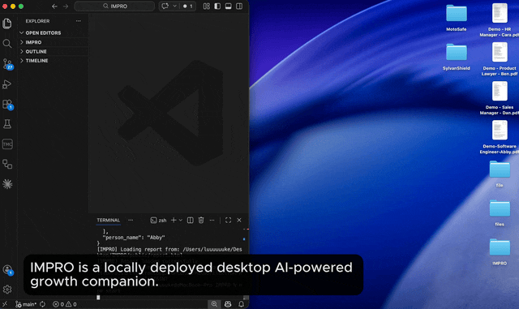

# IMPRO — Personal AI-powerd Career Growth Companion

#### 🏆 Winner of [SOJHOHACKS 2026](https://www.shadowstack.xyz/sohjo-hacks/)  





> *Not an employee monitoring system. An AI companion that grows with you.*

IMPRO is a desktop AI companion that continuously analyses your work behaviour, identifies skill gaps, and guides your personal growth — privately, personally, and without your employer watching over your shoulder.

---

## The Problem

Companies define what skills a role requires. But they rarely know where any individual employee actually stands.

- Training is assigned by role, not by need
- Self-assessments are unreliable
- Completing a course doesn't mean the skill was learned
- Managers can't continuously track team capability

Skill gaps get discovered too late — in performance reviews, failed projects, or resignations.

---

## How IMPRO Works

```
Your work data  →  Behaviour analysis  →  TCS scoring  →  Gap report  →  Learning path
```

IMPRO evaluates every employee across three dimensions:

| Dimension | What it measures | How |
|-----------|-----------------|-----|
| **T** Technical | Role-specific skills | Work documents, code, CRM, AI search history |
| **C** Cognitive | How you think and reason | Scenario-based assessment (Bloom's Taxonomy) |
| **S** Social | Communication, empathy, teamwork | Peer feedback (Goleman's ESI framework) |

Weights are role-specific:

| Role | T | C | S |
|------|---|---|---|
| Developer | 0.60 | 0.25 | 0.15 |
| Lawyer | 0.40 | 0.25 | 0.35 |
| Sales | 0.25 | 0.20 | 0.55 |
| HR | 0.30 | 0.25 | 0.45 |

---

## The Companion

Each role gets a companion animal that evolves as you grow(example):

| Role | Companion |
|------|-----------|
| Software Engineer | 🐙 Byte the Octopus |
| Product Lawyer | 🦉 Lex the Owl |
| Sales Manager | 🦊 Finn the Fox |
| HR Specialist | 🐕 Scout the Dog |

Earn XP by uploading work data, improving skill scores, and closing gaps. XP unlocks companion evolution and company-defined rewards.

---

## Setup

**Prerequisites:** Node.js v24.13.1+

```bash
git clone https://github.com/luuuuukez/IMPRO.git
cd IMPRO
npm install
```

Create a `.env` file in the root:

```
GROQ_API_KEY=your_key_here
```

Run:

```bash
npm start
```
